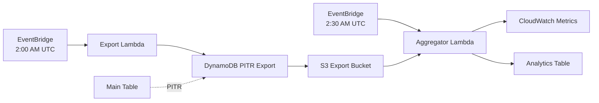

# Design Document: Analytics Lambda Infrastructure

## Overview

This design implements a serverless analytics infrastructure for the
bubblyclouds-api using AWS CDK. The system collects usage metrics from the main
DynamoDB table through scheduled Lambda functions, stores aggregated data in a
dedicated analytics table, and visualizes metrics through a CloudWatch
dashboard.

The architecture leverages DynamoDB's Point-in-Time Recovery (PITR) export
feature to extract data without impacting production table capacity. Two Lambda
functions orchestrate the process: one triggers daily exports to S3, and another
reads the exports, aggregates metrics, and publishes to CloudWatch and the
analytics table.

The system supports both incremental daily processing and historical backfill
from January 17, 2025, enabling complete historical analytics coverage.

## Architecture

### High-Level Flow



### Component Interaction

1. **Export Phase (2:00 AM UTC)**
   - EventBridge triggers Export Lambda
   - Export Lambda calls DynamoDB ExportTableToPointInTime API
   - DynamoDB exports data to S3 (incremental or full based on mode)
   - Export completes asynchronously (typically 5-15 minutes for incremental)

2. **Aggregation Phase (2:30 AM UTC)**
   - EventBridge triggers Aggregator Lambda
   - Aggregator Lambda reads export manifest from S3
   - Aggregator Lambda processes export data files
   - Aggregator Lambda aggregates metrics by app and date
   - Aggregator Lambda publishes metrics to CloudWatch
   - Aggregator Lambda writes detailed records to Analytics Table

### Data Flow

```
Main Table (sessions, parties, members)
    ↓ (PITR Export)
S3 Export Files (DynamoDB JSON format)
    ↓ (Parse & Aggregate)
In-Memory Metrics (by app, by date)
    ↓ (Publish)
CloudWatch Metrics + Analytics Table
```

## Components and Interfaces

### 1. Export Lambda Function

**Purpose**: Trigger DynamoDB table export to S3

**Configuration**:

- Runtime: Node.js 20.x
- Memory: 128 MB
- Timeout: 30 seconds
- Trigger: EventBridge rule (cron: 0 2 * * ? *)

**Environment Variables**:

- `TABLE_NAME`: ARN of the main DynamoDB table
- `EXPORT_BUCKET`: Name of the S3 export bucket
- `MODE`: "incremental" or "backfill"
- `BACKFILL_START_DATE`: ISO date string (e.g., "2025-01-17") - only used in
  backfill mode

**IAM Permissions**:

- `dynamodb:ExportTableToPointInTime` on Main Table
- `s3:PutObject` on Export Bucket
- `s3:AbortMultipartUpload` on Export Bucket

**Handler Logic**:

```typescript
interface ExportRequest {
  mode: "incremental" | "backfill";
  backfillStartDate?: string;
}

async function handler(event: ExportRequest): Promise<void> {
  const exportParams = {
    TableArn: process.env.TABLE_NAME,
    S3Bucket: process.env.EXPORT_BUCKET,
    S3Prefix: `exports/${Date.now()}/`,
    ExportFormat: "DYNAMODB_JSON",
    ExportType: event.mode === "incremental"
      ? "INCREMENTAL_EXPORT"
      : "FULL_EXPORT",
  };

  if (event.mode === "incremental") {
    // Get last export time from previous run (stored in S3 or parameter store)
    exportParams.IncrementalExportSpecification = {
      ExportFromTime: lastExportTime,
      ExportToTime: Date.now(),
    };
  }

  await dynamodb.exportTableToPointInTime(exportParams);
}
```

### 2. Aggregator Lambda Function

**Purpose**: Read S3 exports, aggregate metrics, publish to CloudWatch and
Analytics Table

**Configuration**:

- Runtime: Node.js 20.x
- Memory: 256 MB
- Timeout: 5 minutes (300 seconds)
- Trigger: EventBridge rule (cron: 30 2 * * ? *)

**Environment Variables**:

- `EXPORT_BUCKET`: Name of the S3 export bucket
- `ANALYTICS_TABLE`: Name of the Analytics DynamoDB table
- `MODE`: "incremental" or "backfill"
- `BACKFILL_START_DATE`: ISO date string - only used in backfill mode

**IAM Permissions**:

- `s3:GetObject` on Export Bucket
- `s3:ListBucket` on Export Bucket
- `cloudwatch:PutMetricData` (no resource restriction)
- `dynamodb:PutItem` on Analytics Table

**Handler Logic**:

```typescript
interface AggregatorEvent {
  mode: "incremental" | "backfill";
  backfillStartDate?: string;
}

interface DailyMetrics {
  date: string; // YYYY-MM-DD
  app: string;
  activeUserIds: Set<string>;
  gamesPerUser: Map<string, number>;
  partiesCreatedPerUser: Map<string, number>;
  partiesJoined: number;
}

async function handler(event: AggregatorEvent): Promise<void> {
  // 1. Find latest export in S3
  const exportPrefix = await findLatestExport();

  // 2. Read export manifest
  const manifest = await readManifest(exportPrefix);

  // 3. Process all data files
  const metricsByDateAndApp = new Map<string, Map<string, DailyMetrics>>();

  for (const dataFile of manifest.dataFiles) {
    const items = await readDataFile(dataFile);

    for (const item of items) {
      processItem(item, metricsByDateAndApp, event);
    }
  }

  // 4. Publish metrics to CloudWatch and Analytics Table
  for (const [date, appMetrics] of metricsByDateAndApp) {
    for (const [app, metrics] of appMetrics) {
      await publishMetrics(date, app, metrics);
      await writeAnalyticsRecord(date, app, metrics);
    }
  }
}

function processItem(
  item: DynamoDBItem,
  metricsByDateAndApp: Map<string, Map<string, DailyMetrics>>,
  event: AggregatorEvent,
): void {
  const modelId = item.modelId.S;
  const owner = item.owner.S;

  // Extract app and determine date based on item type
  if (modelId.startsWith("session-")) {
    // session-{app}-{id}
    const app = modelId.split("-")[1];
    const updatedAt = new Date(item.updatedAt.S);
    const date = formatDate(updatedAt);

    if (shouldIncludeDate(date, event)) {
      const metrics = getOrCreateMetrics(metricsByDateAndApp, date, app);
      const userId = owner.replace("user-", "");
      metrics.activeUserIds.add(userId);
      metrics.gamesPerUser.set(
        userId,
        (metrics.gamesPerUser.get(userId) || 0) + 1,
      );
    }
  } else if (modelId.startsWith("party-")) {
    // party-{app}-{id}
    const app = modelId.split("-")[1];
    const createdAt = new Date(item.createdAt.S);
    const date = formatDate(createdAt);

    if (shouldIncludeDate(date, event)) {
      const metrics = getOrCreateMetrics(metricsByDateAndApp, date, app);
      const userId = owner.replace("user-", "");
      metrics.partiesCreatedPerUser.set(
        userId,
        (metrics.partiesCreatedPerUser.get(userId) || 0) + 1,
      );
    }
  } else if (modelId.startsWith("member-user-")) {
    // member-user-{userId}, owner = party-{app}-{id}
    const app = owner.split("-")[1];
    const createdAt = new Date(item.createdAt.S);
    const date = formatDate(createdAt);

    if (shouldIncludeDate(date, event)) {
      const metrics = getOrCreateMetrics(metricsByDateAndApp, date, app);
      metrics.partiesJoined++;
    }
  }
}

function shouldIncludeDate(date: string, event: AggregatorEvent): boolean {
  if (event.mode === "incremental") {
    // Only include yesterday
    const yesterday = getYesterday();
    return date === yesterday;
  } else {
    // Include all dates from backfillStartDate to yesterday
    return date >= event.backfillStartDate && date <= getYesterday();
  }
}

async function publishMetrics(
  date: string,
  app: string,
  metrics: DailyMetrics,
): Promise<void> {
  const timestamp = new Date(`${date}T00:00:00Z`);

  await cloudwatch.putMetricData({
    Namespace: "BubblyClouds/Analytics",
    MetricData: [
      {
        MetricName: "ActiveUsers",
        Value: metrics.activeUserIds.size,
        Timestamp: timestamp,
        Dimensions: [{ Name: "App", Value: app }],
      },
      {
        MetricName: "GamesPlayed",
        Value: Array.from(metrics.gamesPerUser.values()).reduce(
          (a, b) => a + b,
          0,
        ),
        Timestamp: timestamp,
        Dimensions: [{ Name: "App", Value: app }],
      },
      {
        MetricName: "PartiesCreated",
        Value: Array.from(metrics.partiesCreatedPerUser.values()).reduce(
          (a, b) => a + b,
          0,
        ),
        Timestamp: timestamp,
        Dimensions: [{ Name: "App", Value: app }],
      },
      {
        MetricName: "PartiesJoined",
        Value: metrics.partiesJoined,
        Timestamp: timestamp,
        Dimensions: [{ Name: "App", Value: app }],
      },
    ],
  });
}

async function writeAnalyticsRecord(
  date: string,
  app: string,
  metrics: DailyMetrics,
): Promise<void> {
  const expiresAt = Math.floor(Date.now() / 1000) + (455 * 24 * 60 * 60); // 455 days

  await dynamodb.putItem({
    TableName: process.env.ANALYTICS_TABLE,
    Item: {
      date: { S: date },
      app: { S: app },
      activeUserIds: { SS: Array.from(metrics.activeUserIds) },
      gamesPerUser: { M: mapToAttributeValue(metrics.gamesPerUser) },
      partiesCreatedPerUser: {
        M: mapToAttributeValue(metrics.partiesCreatedPerUser),
      },
      partiesJoined: { N: metrics.partiesJoined.toString() },
      summary: {
        M: {
          activeUsers: { N: metrics.activeUserIds.size.toString() },
          gamesPlayed: {
            N: Array.from(metrics.gamesPerUser.values()).reduce(
              (a, b) => a + b,
              0,
            ).toString(),
          },
          partiesCreated: {
            N: Array.from(metrics.partiesCreatedPerUser.values()).reduce(
              (a, b) => a + b,
              0,
            ).toString(),
          },
          partiesJoined: { N: metrics.partiesJoined.toString() },
        },
      },
      expiresAt: { N: expiresAt.toString() },
    },
  });
}
```

### 3. Analytics DynamoDB Table

**Purpose**: Store per-user daily metric breakdowns with 455-day retention

**Schema**:

```typescript
interface AnalyticsRecord {
  date: string; // PK: YYYY-MM-DD
  app: string; // SK: app identifier
  activeUserIds: string[]; // List of user IDs active on this date
  gamesPerUser: Record<string, number>; // userId -> game count
  partiesCreatedPerUser: Record<string, number>; // userId -> party count
  partiesJoined: number; // Total party joins
  summary: {
    activeUsers: number;
    gamesPlayed: number;
    partiesCreated: number;
    partiesJoined: number;
  };
  expiresAt: number; // TTL timestamp (455 days)
}
```

**Configuration**:

- Partition Key: `date` (String)
- Sort Key: `app` (String)
- Provisioned Capacity: 1 RCU, 1 WCU (minimum)
- TTL Attribute: `expiresAt`
- TTL Duration: 455 days (matches CloudWatch retention)

**Access Patterns**:

- Write: One record per app per day (low frequency)
- Read: Rare, primarily for debugging or custom queries
- Query: By date to get all apps for a specific day
- Query: By date and app for specific app metrics

### 4. S3 Export Bucket

**Purpose**: Temporary storage for DynamoDB export files

**Configuration**:

- Region: eu-west-2
- Lifecycle Policy: Delete objects after 1 day
- Removal Policy: Destroy (auto-delete on stack removal)
- Versioning: Disabled
- Encryption: Default (SSE-S3)

**Folder Structure**:

```
exports/
  {timestamp}/
    AWSDynamoDB/
      {export-id}/
        manifest-summary.json
        manifest-files.json
        data/
          {file-1}.json.gz
          {file-2}.json.gz
          ...
```

### 5. CloudWatch Dashboard

**Purpose**: Visualize application metrics with auto-discovered app dimensions

**Configuration**:

- Region: eu-west-2
- Retention: 455 days (CloudWatch default for custom metrics)
- Cost: $3/month per dashboard

**Metrics**:

- Namespace: `BubblyClouds/Analytics`
- Metrics:
  - `ActiveUsers` (dimension: App)
  - `GamesPlayed` (dimension: App)
  - `PartiesCreated` (dimension: App)
  - `PartiesJoined` (dimension: App)

**Dashboard Layout**:

```json
{
  "widgets": [
    {
      "type": "metric",
      "properties": {
        "metrics": [
          ["SEARCH('{BubblyClouds/Analytics,App} MetricName=\"ActiveUsers\"', 'Sum', 86400)"]
        ],
        "title": "Active Users by App",
        "period": 86400,
        "stat": "Sum",
        "region": "eu-west-2"
      }
    },
    {
      "type": "metric",
      "properties": {
        "metrics": [
          ["SEARCH('{BubblyClouds/Analytics,App} MetricName=\"GamesPlayed\"', 'Sum', 86400)"]
        ],
        "title": "Games Played by App",
        "period": 86400,
        "stat": "Sum",
        "region": "eu-west-2"
      }
    },
    {
      "type": "metric",
      "properties": {
        "metrics": [
          ["SEARCH('{BubblyClouds/Analytics,App} MetricName=\"PartiesCreated\"', 'Sum', 86400)"]
        ],
        "title": "Parties Created by App",
        "period": 86400,
        "stat": "Sum",
        "region": "eu-west-2"
      }
    },
    {
      "type": "metric",
      "properties": {
        "metrics": [
          ["SEARCH('{BubblyClouds/Analytics,App} MetricName=\"PartiesJoined\"', 'Sum', 86400)"]
        ],
        "title": "Parties Joined by App",
        "period": 86400,
        "stat": "Sum",
        "region": "eu-west-2"
      }
    }
  ]
}
```

### 6. EventBridge Rules

**Export Rule**:

- Schedule: `cron(0 2 * * ? *)` - 2:00 AM UTC daily
- Target: Export Lambda
- Input: `{ "mode": "incremental" }`

**Aggregator Rule**:

- Schedule: `cron(30 2 * * ? *)` - 2:30 AM UTC daily
- Target: Aggregator Lambda
- Input: `{ "mode": "incremental" }`

**Backfill Execution** (manual):

- Invoke Export Lambda with:
  `{ "mode": "backfill", "backfillStartDate": "2025-01-17" }`
- Wait for export completion (~30-60 minutes for full table)
- Invoke Aggregator Lambda with:
  `{ "mode": "backfill", "backfillStartDate": "2025-01-17" }`

## Data Models

### DynamoDB Export Format

DynamoDB exports use the DynamoDB JSON format:

```json
{
  "Item": {
    "modelId": { "S": "session-sudoku-abc123" },
    "owner": { "S": "user-user456" },
    "updatedAt": { "S": "2025-01-20T14:30:00.000Z" },
    "createdAt": { "S": "2025-01-20T14:00:00.000Z" }
  }
}
```

### Metric Extraction Patterns

**Session Records** (Active Users & Games Played):

- Pattern: `modelId = "session-{app}-{id}"`
- User ID: Extract from `owner = "user-{userId}"`
- Date: Extract from `updatedAt` timestamp
- Active Users: Count distinct user IDs per app per date
- Games Played: Count all sessions per app per date

**Party Records** (Parties Created):

- Pattern: `modelId = "party-{app}-{id}"`
- User ID: Extract from `owner = "user-{userId}"`
- Date: Extract from `createdAt` timestamp
- Parties Created: Count all parties per app per date

**Member Records** (Parties Joined):

- Pattern: `modelId = "member-user-{userId}"`, `owner = "party-{app}-{id}"`
- App: Extract from `owner` attribute
- Date: Extract from `createdAt` timestamp
- Parties Joined: Count all member records per app per date

### CloudWatch Metric Format

```typescript
interface CloudWatchMetric {
  MetricName:
    | "ActiveUsers"
    | "GamesPlayed"
    | "PartiesCreated"
    | "PartiesJoined";
  Value: number;
  Timestamp: Date; // Start of target day (00:00:00 UTC)
  Dimensions: [
    { Name: "App"; Value: string },
  ];
  Unit: "Count";
}
```

## Correctness Properties

_A property is a characteristic or behavior that should hold true across all
valid executions of a system—essentially, a formal statement about what the
system should do. Properties serve as the bridge between human-readable
specifications and machine-verifiable correctness guarantees._

### Property Reflection

After analyzing all acceptance criteria, I identified the following
redundancies:

**Duplicate Properties to Consolidate:**

- 3.1 and 4.1: Both test date filtering for session records - combine into one
  property
- 3.3, 4.3, 5.3: All test app extraction from modelId - combine into one
  property
- 3.4, 4.4, 5.4, 6.4: All test timestamp formatting to midnight UTC - combine
  into one property
- 6.2 and 6.3: Both test app extraction from member owner attribute - combine
  into one property
- 1.3 and 11.1: Both test full export in backfill mode - combine into one
  property
- 2.3 and 11.2: Both test backfill date range processing - combine into one
  property
- 1.2 and 13.1: Both test incremental export mode - combine into one property

**Properties to Keep Separate:**

- 3.2 (distinct user ID extraction), 3.5 (storing user IDs), 4.2 (session
  pattern matching), 4.5 (per-user game counts), 5.2 (party pattern matching),
  5.5 (per-user party counts), 6.1 (member date filtering), 6.5 (total parties
  joined count), 11.3 (timestamp field selection), 11.4 (record partitioning),
  11.5 (backfill metric timestamps) - each provides unique validation value

### Correctness Properties

Property 1: Session date filtering _For any_ set of DynamoDB records and target
date, when filtering session records, only records with modelId starting with
"session-" and updatedAt timestamp within the target day should be included in
the result set. **Validates: Requirements 3.1, 4.1**

Property 2: Distinct user ID extraction from sessions _For any_ set of session
records for a given app and date, the count of active users should equal the
number of distinct user IDs extracted from the owner attribute. **Validates:
Requirements 3.2**

Property 3: App extraction from modelId _For any_ record with modelId pattern
"{type}-{app}-{id}", the extracted app value should equal the second segment
when split by hyphen. **Validates: Requirements 3.3, 4.3, 5.3**

Property 4: Metric timestamp formatting _For any_ target date string in
YYYY-MM-DD format, the CloudWatch metric timestamp should be set to the start of
that day at 00:00:00 UTC. **Validates: Requirements 3.4, 4.4, 5.4, 6.4**

Property 5: Active user IDs storage completeness _For any_ set of session
records aggregated for a date and app, the activeUserIds array stored in
Analytics_Table should contain all distinct user IDs from those sessions.
**Validates: Requirements 3.5**

Property 6: Session pattern matching _For any_ set of DynamoDB records, when
counting games played, only records with modelId matching the pattern
"session-{app}-{id}" should be included in the count. **Validates: Requirements
4.2**

Property 7: Per-user game count aggregation _For any_ set of session records for
a given app and date, each user's game count in gamesPerUser should equal the
number of session records with that user's ID in the owner attribute.
**Validates: Requirements 4.5**

Property 8: Party date filtering _For any_ set of DynamoDB records and target
date, when filtering party records, only records with modelId starting with
"party-" and createdAt timestamp within the target day should be included in the
result set. **Validates: Requirements 5.1**

Property 9: Party pattern matching _For any_ set of DynamoDB records, when
counting parties created, only records with modelId matching the pattern
"party-{app}-{id}" should be included in the count. **Validates: Requirements
5.2**

Property 10: Per-user party creation count aggregation _For any_ set of party
records for a given app and date, each user's party creation count in
partiesCreatedPerUser should equal the number of party records with that user's
ID in the owner attribute. **Validates: Requirements 5.5**

Property 11: Member date filtering _For any_ set of DynamoDB records and target
date, when filtering member records, only records with modelId starting with
"member-user-" and createdAt timestamp within the target day should be included
in the result set. **Validates: Requirements 6.1**

Property 12: App extraction from member owner attribute _For any_ member record
with owner pattern "party-{app}-{id}", the extracted app value should equal the
second segment when split by hyphen. **Validates: Requirements 6.2, 6.3**

Property 13: Parties joined count aggregation _For any_ set of member records
for a given app and date, the partiesJoined count should equal the total number
of member records. **Validates: Requirements 6.5**

Property 14: Timestamp field selection by record type _For any_ DynamoDB record,
when determining the date for aggregation, session records should use the
updatedAt field, while party and member records should use the createdAt field.
**Validates: Requirements 11.3**

Property 15: Analytics record partitioning _For any_ set of aggregated metrics,
there should be exactly one Analytics_Table record written per unique
combination of date and app. **Validates: Requirements 11.4**

Property 16: Backfill metric timestamp distribution _For any_ date range in
backfill mode, each date should have CloudWatch metrics published with a
timestamp set to midnight UTC of that specific date. **Validates: Requirements
11.5**

## Error Handling

### Export Lambda Error Handling

**Export API Failures**:

- Catch `DynamoDB.ExportTableToPointInTime` errors
- Log error details including table ARN, bucket name, and error message
- Throw error to trigger Lambda failure (for CloudWatch alerting)
- Do not retry automatically (EventBridge will retry on next schedule)

**Configuration Errors**:

- Validate environment variables on cold start
- Throw descriptive error if TABLE_NAME or EXPORT_BUCKET is missing
- Validate mode parameter is either "incremental" or "backfill"

**Example Error Handling**:

```typescript
try {
  validateEnvironment();
  const exportParams = buildExportParams(event);
  await dynamodb.exportTableToPointInTime(exportParams);
  console.log("Export initiated successfully", { exportParams });
} catch (error) {
  console.error("Export failed", {
    error: error.message,
    stack: error.stack,
    tableName: process.env.TABLE_NAME,
    bucket: process.env.EXPORT_BUCKET,
    mode: event.mode,
  });
  throw error;
}
```

### Aggregator Lambda Error Handling

**S3 Read Failures**:

- Catch S3 errors when reading manifest or data files
- Log error details including bucket, key, and error message
- Throw error to trigger Lambda failure

**Malformed Data Handling**:

- Wrap individual record processing in try-catch
- Log malformed record details (modelId, owner if available)
- Continue processing remaining records
- Track count of malformed records
- Log summary at end of processing

**CloudWatch Publishing Failures**:

- Catch `CloudWatch.PutMetricData` errors
- Log error details including metric names and dimensions
- Continue processing (don't fail entire job for metric publishing)
- Attempt to write to Analytics_Table even if CloudWatch fails

**DynamoDB Write Failures**:

- Catch `DynamoDB.PutItem` errors
- Log error details including date, app, and error message
- Continue processing remaining records
- Track count of failed writes

**Example Error Handling**:

```typescript
async function processItems(items: DynamoDBItem[]): Promise<void> {
  let malformedCount = 0;

  for (const item of items) {
    try {
      processItem(item, metricsByDateAndApp, event);
    } catch (error) {
      malformedCount++;
      console.warn("Malformed record skipped", {
        modelId: item.modelId?.S,
        owner: item.owner?.S,
        error: error.message,
      });
    }
  }

  if (malformedCount > 0) {
    console.warn(`Skipped ${malformedCount} malformed records`);
  }
}

async function publishMetrics(
  date: string,
  app: string,
  metrics: DailyMetrics,
): Promise<void> {
  try {
    await cloudwatch.putMetricData(buildMetricData(date, app, metrics));
  } catch (error) {
    console.error("Failed to publish CloudWatch metrics", {
      date,
      app,
      error: error.message,
    });
    // Don't throw - continue to write Analytics_Table
  }
}
```

### Timeout Handling

**Export Lambda** (30s timeout):

- Export API call is asynchronous (returns immediately)
- Timeout should never be reached under normal conditions
- If timeout occurs, indicates AWS API issue

**Aggregator Lambda** (5min timeout):

- Monitor processing time for large exports
- Log progress periodically (every 1000 records)
- If approaching timeout, log warning with current progress
- Consider increasing timeout if table grows significantly

### Retry Strategy

**Export Lambda**:

- No automatic retries within Lambda
- EventBridge will trigger next day's export on schedule
- Manual retry: Re-invoke Lambda with same parameters

**Aggregator Lambda**:

- No automatic retries within Lambda
- EventBridge will trigger next day's aggregation on schedule
- Manual retry: Re-invoke Lambda with same parameters
- Idempotent: Re-running for same date will overwrite previous Analytics_Table
  records

## Testing Strategy

### Unit Testing

Unit tests will verify specific examples, edge cases, and error conditions for
both Lambda functions and CDK infrastructure.

**Export Lambda Unit Tests**:

- Test incremental mode constructs correct API parameters
- Test backfill mode constructs correct API parameters
- Test environment variable validation
- Test error handling for missing configuration
- Test error logging format

**Aggregator Lambda Unit Tests**:

- Test S3 manifest parsing
- Test DynamoDB JSON format parsing
- Test date extraction from timestamps
- Test app extraction from modelId patterns
- Test app extraction from owner patterns
- Test Analytics_Table record structure
- Test CloudWatch metric structure
- Test TTL calculation (455 days)
- Test error handling for malformed records
- Test error logging format

**CDK Infrastructure Unit Tests**:

- Test Analytics_Table has correct schema (PK: date, SK: app)
- Test Analytics_Table has TTL enabled
- Test Analytics_Table has minimum capacity (1 RCU, 1 WCU)
- Test Export_Bucket has 1-day lifecycle policy
- Test Export_Bucket has destroy removal policy
- Test Export Lambda has correct timeout (30s) and memory (128 MB)
- Test Aggregator Lambda has correct timeout (5min) and memory (256 MB)
- Test EventBridge rules have correct schedules (2:00 AM and 2:30 AM UTC)
- Test EventBridge rules have 30-minute gap
- Test Export Lambda IAM policy includes dynamodb:ExportTableToPointInTime on
  Main_Table
- Test Export Lambda IAM policy includes s3:PutObject on Export_Bucket
- Test Aggregator Lambda IAM policy includes s3:GetObject and s3:ListBucket on
  Export_Bucket
- Test Aggregator Lambda IAM policy includes cloudwatch:PutMetricData
- Test Aggregator Lambda IAM policy includes dynamodb:PutItem on Analytics_Table
- Test CloudWatch Dashboard includes all four metrics
- Test CloudWatch Dashboard uses SEARCH expressions

### Property-Based Testing

Property tests will verify universal properties across all inputs using a
property-based testing library. Each test will run a minimum of 100 iterations
with randomized inputs.

**Testing Library**: Use `fast-check` for TypeScript property-based testing

**Property Test 1: Session date filtering**

- Generate: Random sets of DynamoDB records with various modelId patterns and
  timestamps
- Property: Only records with modelId starting with "session-" and updatedAt
  within target day are included
- Tag: **Feature: analytics-lambda-infrastructure, Property 1: Session date
  filtering**

**Property Test 2: Distinct user ID extraction from sessions**

- Generate: Random sets of session records with duplicate and unique user IDs
- Property: Active user count equals number of distinct user IDs
- Tag: **Feature: analytics-lambda-infrastructure, Property 2: Distinct user ID
  extraction from sessions**

**Property Test 3: App extraction from modelId**

- Generate: Random modelId strings with pattern "{type}-{app}-{id}"
- Property: Extracted app equals second segment
- Tag: **Feature: analytics-lambda-infrastructure, Property 3: App extraction
  from modelId**

**Property Test 4: Metric timestamp formatting**

- Generate: Random date strings in YYYY-MM-DD format
- Property: Timestamp is set to midnight UTC of that date
- Tag: **Feature: analytics-lambda-infrastructure, Property 4: Metric timestamp
  formatting**

**Property Test 5: Active user IDs storage completeness**

- Generate: Random sets of session records
- Property: Stored activeUserIds contains all distinct user IDs
- Tag: **Feature: analytics-lambda-infrastructure, Property 5: Active user IDs
  storage completeness**

**Property Test 6: Session pattern matching**

- Generate: Random sets of records with various modelId patterns
- Property: Only records matching "session-{app}-{id}" are counted
- Tag: **Feature: analytics-lambda-infrastructure, Property 6: Session pattern
  matching**

**Property Test 7: Per-user game count aggregation**

- Generate: Random sets of session records with various user IDs
- Property: Each user's count equals their number of sessions
- Tag: **Feature: analytics-lambda-infrastructure, Property 7: Per-user game
  count aggregation**

**Property Test 8: Party date filtering**

- Generate: Random sets of party records with various timestamps
- Property: Only records with createdAt within target day are included
- Tag: **Feature: analytics-lambda-infrastructure, Property 8: Party date
  filtering**

**Property Test 9: Party pattern matching**

- Generate: Random sets of records with various modelId patterns
- Property: Only records matching "party-{app}-{id}" are counted
- Tag: **Feature: analytics-lambda-infrastructure, Property 9: Party pattern
  matching**

**Property Test 10: Per-user party creation count aggregation**

- Generate: Random sets of party records with various user IDs
- Property: Each user's count equals their number of created parties
- Tag: **Feature: analytics-lambda-infrastructure, Property 10: Per-user party
  creation count aggregation**

**Property Test 11: Member date filtering**

- Generate: Random sets of member records with various timestamps
- Property: Only records with createdAt within target day are included
- Tag: **Feature: analytics-lambda-infrastructure, Property 11: Member date
  filtering**

**Property Test 12: App extraction from member owner attribute**

- Generate: Random owner strings with pattern "party-{app}-{id}"
- Property: Extracted app equals second segment
- Tag: **Feature: analytics-lambda-infrastructure, Property 12: App extraction
  from member owner attribute**

**Property Test 13: Parties joined count aggregation**

- Generate: Random sets of member records
- Property: Total count equals number of member records
- Tag: **Feature: analytics-lambda-infrastructure, Property 13: Parties joined
  count aggregation**

**Property Test 14: Timestamp field selection by record type**

- Generate: Random DynamoDB records of different types (session, party, member)
- Property: Sessions use updatedAt, parties and members use createdAt
- Tag: **Feature: analytics-lambda-infrastructure, Property 14: Timestamp field
  selection by record type**

**Property Test 15: Analytics record partitioning**

- Generate: Random sets of aggregated metrics with various date/app combinations
- Property: Exactly one record per unique (date, app) combination
- Tag: **Feature: analytics-lambda-infrastructure, Property 15: Analytics record
  partitioning**

**Property Test 16: Backfill metric timestamp distribution**

- Generate: Random date ranges
- Property: Each date has metrics with timestamp at midnight UTC of that date
- Tag: **Feature: analytics-lambda-infrastructure, Property 16: Backfill metric
  timestamp distribution**

### Integration Testing

Integration tests will verify end-to-end flows with actual AWS services (using
LocalStack or AWS test accounts):

- Test Export Lambda triggers DynamoDB export successfully
- Test Aggregator Lambda reads S3 export and writes to Analytics_Table
- Test Aggregator Lambda publishes metrics to CloudWatch
- Test EventBridge rules trigger Lambdas on schedule
- Test IAM permissions allow required operations
- Test IAM permissions deny unauthorized operations

### Manual Testing

Manual testing will verify the complete system:

- Deploy CDK stack to test environment
- Trigger Export Lambda manually with incremental mode
- Wait for export completion
- Trigger Aggregator Lambda manually
- Verify Analytics_Table contains expected records
- Verify CloudWatch metrics are published
- Verify CloudWatch Dashboard displays metrics correctly
- Test backfill mode with historical date range
- Verify cost estimates match actual AWS billing

### Test Data Generation

For property-based tests, generate realistic test data:

```typescript
// Example generators using fast-check
const sessionRecordGen = fc.record({
  modelId: fc.tuple(fc.constant("session"), fc.string(), fc.uuid())
    .map(([prefix, app, id]) => `${prefix}-${app}-${id}`),
  owner: fc.uuid().map((id) => `user-${id}`),
  updatedAt: fc.date().map((d) => d.toISOString()),
  createdAt: fc.date().map((d) => d.toISOString()),
});

const partyRecordGen = fc.record({
  modelId: fc.tuple(fc.constant("party"), fc.string(), fc.uuid())
    .map(([prefix, app, id]) => `${prefix}-${app}-${id}`),
  owner: fc.uuid().map((id) => `user-${id}`),
  createdAt: fc.date().map((d) => d.toISOString()),
});

const memberRecordGen = fc.record({
  modelId: fc.uuid().map((id) => `member-user-${id}`),
  owner: fc.tuple(fc.constant("party"), fc.string(), fc.uuid())
    .map(([prefix, app, id]) => `${prefix}-${app}-${id}`),
  createdAt: fc.date().map((d) => d.toISOString()),
});
```
